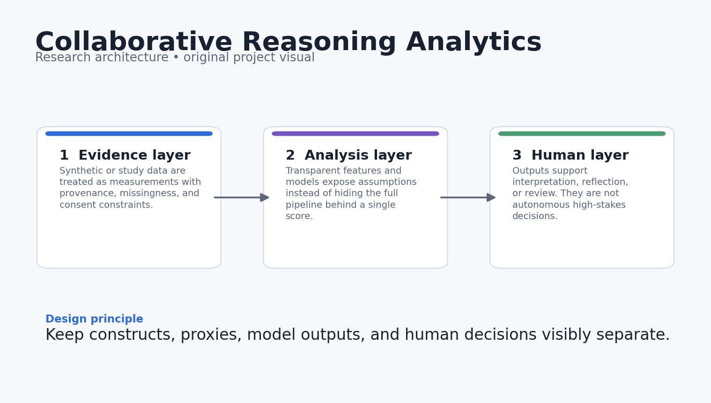
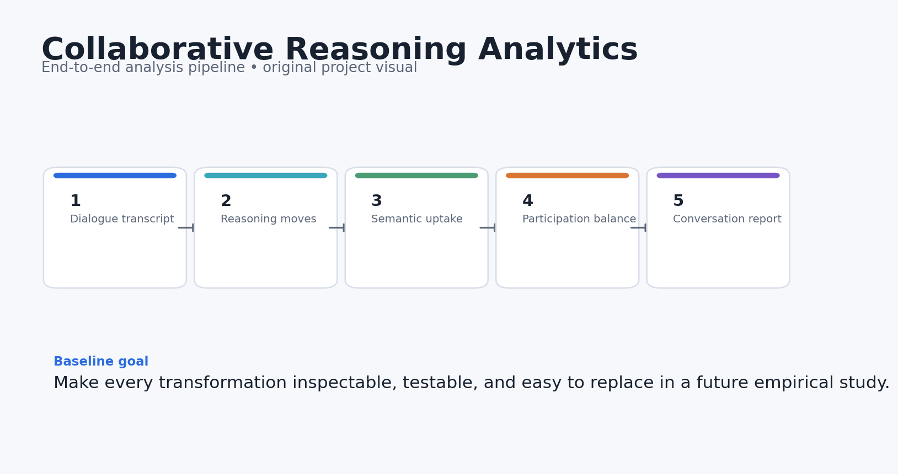
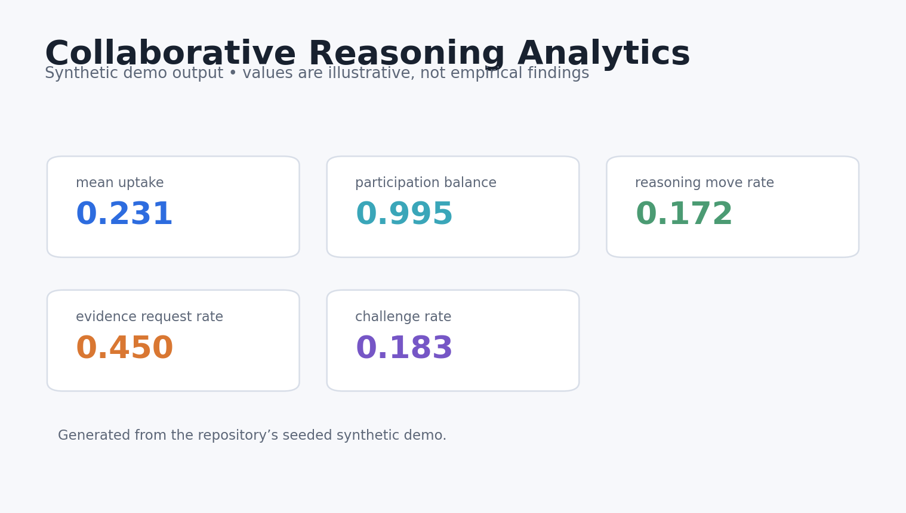
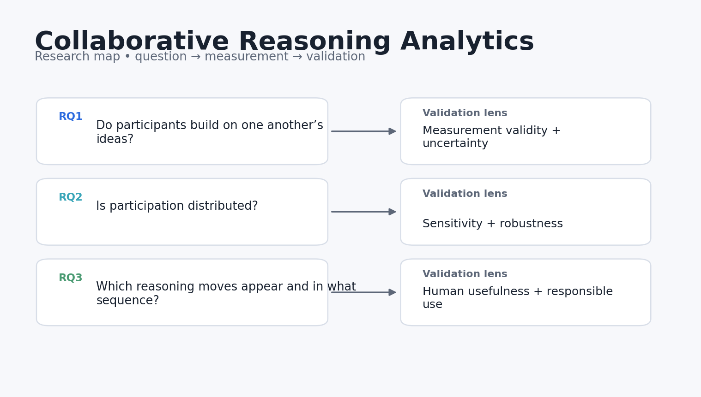

# Collaborative Reasoning Analytics

[](https://github.com/devissaputra/collaborative_reasoning_analytics/actions/workflows/ci.yml)


**Category:** AI in Education
**Lightweight NLP for semantic uptake, participation balance, and reasoning moves in group learning.**

> Research prototype. All bundled data and results are synthetic demonstrations. Nothing in this repository should be interpreted as evidence about real learners, teachers, or institutions.



## Why this project exists

Collaboration quality is not captured by who spoke most. This repo focuses on whether participants build on one another’s ideas, ask for evidence, challenge claims, and connect reasons to conclusions.

The pipeline treats uptake, participation, and reasoning moves as separate signals instead of collapsing collaboration into one score. That makes it easier to inspect why a conversation receives a given summary and where simple NLP proxies break down.

## Research questions

1. How much semantic uptake occurs across adjacent turns?
2. Is participation distributed or dominated by one speaker?
3. Which reasoning moves appear, and how are they sequenced?

## What the repository does



The reference pipeline follows five stages:

1. **Dialogue transcript**
2. **Reasoning move tagging**
3. **Semantic uptake**
4. **Participation balance**
5. **Conversation report**

The baseline is deliberately transparent so rule-based measures can later be compared with embedding-based or supervised discourse models.

## Core outputs

- `mean_uptake`
- `participation_balance`
- `reasoning_move_rate`
- `evidence_request_rate`
- `challenge_rate`



The dashboard above is generated from **synthetic data** and is included only to show what the analysis surface looks like. It is not a reported empirical result.

## Quick start

```bash
python -m venv .venv
source .venv/bin/activate  # Windows: .venv\Scripts\activate
pip install -e .[dev]
python examples/demo.py
pytest -q
```

You can also use Docker:

```bash
docker build -t collaborative_reasoning_analytics .
docker run --rm collaborative_reasoning_analytics
```

## Repository structure

```text
collaborative_reasoning_analytics/
├── src/collaborative_reasoning_analytics/        # core implementation and synthetic-data generator
├── examples/demo.py        # end-to-end reproducible demo
├── tests/                  # executable unit tests
├── docs/                   # research design, data dictionary, references
│   └── images/             # original project diagrams and demo visualisations
├── results/                # synthetic demo outputs only
├── config/default.yaml
├── Dockerfile
├── Makefile
└── pyproject.toml
```

## Research design in one picture



The fuller design rationale is in [`docs/research_design.md`](docs/research_design.md), including constructs, assumptions, validation steps, and a proposed empirical extension.

## Reproducibility choices

- Synthetic generation uses a fixed random seed.
- The core metrics are implemented as small, testable functions.
- The demo writes machine-readable results into `results/`.
- CI runs the tests on every push and pull request.
- No API keys, proprietary datasets, or external model calls are required for the baseline.

## Responsible-use boundaries

- Lexical overlap is only a rough proxy for conceptual uptake.
- Rule-based move labels are transparent baselines, not validated discourse annotations.
- Conversation metrics should support reflection, not rank individual students.

## Strong next experiments

- Fine-tune a discourse-move classifier with inter-rater reliability reporting.
- Add embedding-based uptake and delayed cross-turn references.
- Visualize group-level reasoning networks over time.

## References

See [`docs/references.md`](docs/references.md). The references are there to locate the project in current AIED, learning-analytics, human-centered AI, and instructional-design research. They do **not** imply endorsement or affiliation.

## Citation

If you build on this research prototype, use the metadata in [`CITATION.cff`](CITATION.cff).

## License

MIT for the code in this repository. Research data from future studies should use a separate data-governance and consent process.
